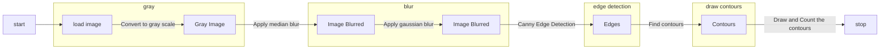
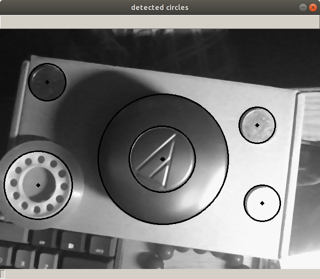
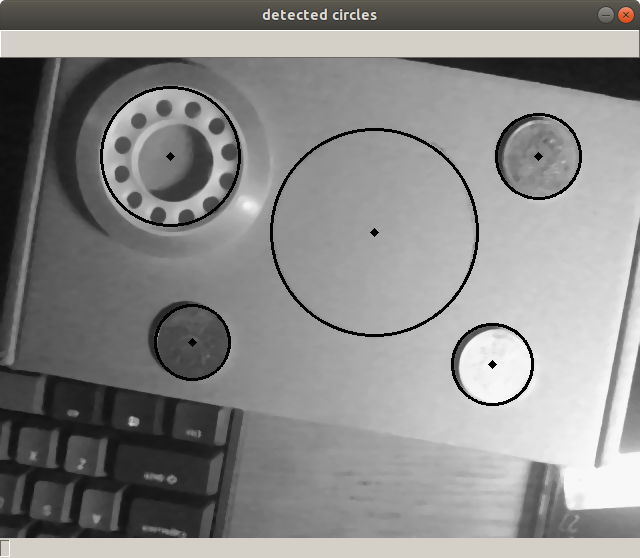

## Coin and circle counters for python using OpenCV
   

A program that detects the number of coins or circles in an image    
> 一个可以检测图片中硬币或者圆圈数量的程序
## Table of Contents
- [Background](#background)
- [Install](#install)
- [Usage](#usage)
- [Related Efforts](#related-efforts)
- [Maintainers](#maintainers)
- [Contributing](#contributing)
- [License](#license)

## Background
When studying CV basic operations, I want to use these skills to detect some thing, and that's why I made this proj                 
在学习计算机视觉基础操作的时候，我想利用这些技巧去检测一些东西，受到一些项目启发，做了这个项目来对图片或者实时视频中的硬币或圆形物体进行检测
## Install
Just **Download** and **Unzip** the repo!
## Usage
##### 1.Find coins in an image statically
```
python3 coin_counter_test_to_find_good_parameter.py
```

<!--load image -> convert to grey scale -> apply median blur -> apply gaussian blur -> apply canny edge detection -> find contours -> draw contours -> count the number of contours -> thus, count the number of coins.<br><br>-->


##### 2.Find circles from video instantly
```
python3 Find_Circles_And_Say.py
```
examples:




## Related Efforts
## Maintainers
[@DenryDu](https://github.com/DenryDu)
## Contributors
## License

***
If you find this useful, please star it! :)
Denry Du 2019
